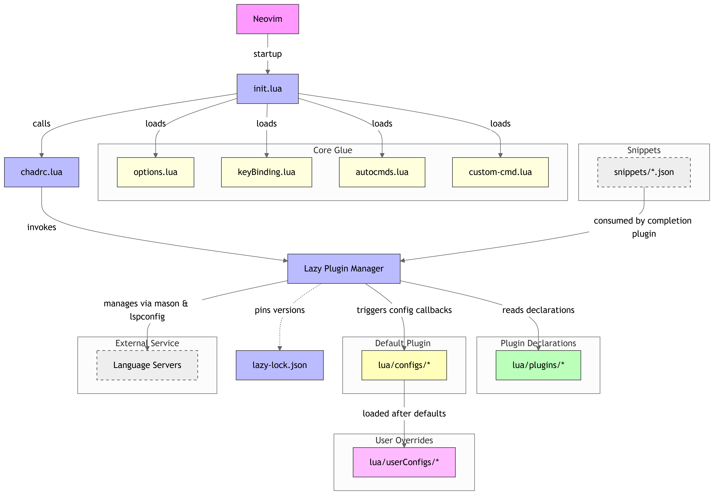

# Project README

## project config structure


## Project Name
Provide the name of your project here.

## Description
Briefly describe the purpose and functionality of your project.

## Features
- Feature 1
- Feature 2
- Feature 3

## Installation
1. Clone the repository:
    ```bash
    git clone <repository-url>
    ```
2. Navigate to the project directory:
    ```bash
    cd <project-directory>
    ```
3. Install dependencies:
    ```bash
    <installation-command>
    ```

## Usage
Provide instructions on how to use the project:
```bash
<usage-command>
```

## Contributing
1. Fork the repository.
2. Create a new branch:
    ```bash
    git checkout -b <branch-name>
    ```
3. Make your changes and commit them:
    ```bash
    git commit -m "<commit-message>"
    ```
4. Push to the branch:
    ```bash
    git push origin <branch-name>
    ```
5. Open a pull request.

## [License](./license)
My project using MIT license. If you feel interested in repo, you may PR or fork

## Contact
Provide contact information or links for further inquiries.